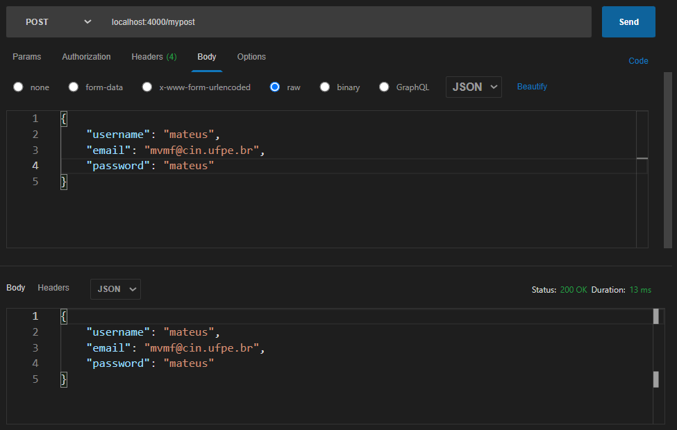

# react-nodejs-101
First steps on making a project utilizing React and Node.Js Express.

## Getting Started
On your empty workspace, create the `client` directory (it will hold your React app), and run the following command inside it:
```
npx create-react-app .
``` 
And to run your app:
```
npm start
```

Create a `server` directory (which will host your Node.js Express server), create a `index.js` file, and run the command:
```
npm install express nodemon
```

Write on your `index.js` file:
```javascript
const express = require('express');
const app = express();

app.get('/ping', (req, res) => {
    res.json('ping!')
});

app.listen(4000);
```
  
The `req` (request) object contains the body and every other information sent through the HTTP request, and the `res` (response) object is used to handle the responses that may be sent back to your client.

And to run your server:
```javascript
nodemon index.js
```

## React Pages

React's `react-router-dom` package is very useful when creating new pages for your web application.

### Configurations

Import `BrowserRouter` on your index.js, and add the `App` inside of the `BrowserRouter` tag:

```javascript
import React from 'react';
import ReactDOM from 'react-dom/client';
import { BrowserRouter } from 'react-router-dom';

import reportWebVitals from './reportWebVitals';


const root = ReactDOM.createRoot(document.getElementById('root'));
root.render(
  <React.StrictMode>
    <BrowserRouter>
      <App />
    </BrowserRouter>
  </React.StrictMode>
);

reportWebVitals();
```

Make sure you have the `react-router-dom` package installed:

```
npm install react-router-dom -S
```

Add the index page on `App.js`:

```javascript
import './App.css';
import { Routes, Route } from 'react-router-dom';


function App() {
  return (
    <Routes>
      <Route index element={
        <div className="Index">
        </div>
      } />
    </Routes>

  );
}

export default App;
```

### Creating Pages

To add a new page on your web app, you select a path do this page, and insert a new route on `App.js`:

```javascript
import './App.css';
import { Routes, Route } from 'react-router-dom';


function App() {
  return (
    <Routes>

        <Route index element={
            <div className="Index">
            </div>
        } />

        <Route path={'/newpage'} element={
            <div className="NewPage">
            </div>
        } />

    </Routes>

  );
}

export default App;
```

Once your web app compile again, you can access this new page going to its URL: `localhost:3000/newpage`. It won't have anything, since there's only an empty div on it. You haven't added any components.  
There's also no way to get to this new page while clicking on any links. You need to use the attribute `href` to do that.

#### Creating Pages and Components

On the `client/src` directory, create a new `Components` custom directory, and inside of it make a JavaScript file named `Header.js`. On this file, you will export the HTML code of your new component. Here is an example:

```javascript
export default function Header() {
    return (
        <header className="App-header">
            <a href="/" className="App-logo">Logo</a>

            <nav>
                <a href="/newpage">New Page</a>
            </nav>
        </header>
    );
}
```
When this component is running on your web app, as you click on the `Logo` link, you will be redirected to the index page specified on your routes since the `href` attribute is set to `/`. The same way, when you click on the `New Page` link, you will be redirected to the new page specified on your routes since the `href` attribute is set to `/newpage`.    

After importing your component you can now use it by adding a tag on your Routes. Your component and tag name must match. Since on this case the exported component function is called `Header()`, its file name must be called `Header.js`, and the tag is `<Header />`. Your `App.js` will look something like this:

```javascript
import './App.css';
import Header from './Components/Header';

function App() {
  return (
    <Routes>

        <Route index element={
            <div className="Index">
                <Header />

            </div>
        } />

        <Route path={'/newpage'} element={
            <div className="NewPage">
                <Header />
                
            </div>
        } />

    </Routes>

  );
}

export default App;
```
  
For bigger projects, you can divide pages and components as well. I personally like to create a `Pages` folder for all React routes, and inside of it create the `Components` folder for all separate items such as header/footer/etc.

## Node.js Routes

Routes on Node.js are different from routes on React. The routes on React are the routes your web app use (on the client-side) within a web page. It's all about UI and rendering components. Node.js routes, particularly when using Express, handle server-sided routing, and their responses to different HTTP requests. The four main HTTP requests methods are `GET`, `POST`, `PUT` and `DELETE`.  
  
To test your web API, you will need some sort of tool to try and send your HTTP requests, such as the online tool Postman, or the VS Code plugin Postcode like I did.

### GET request

To be added.

### POST request

POST requests are used to submit data, like when you send in a forms or upload a file. The data submitted with a POST request is typically included in the body of the request, rather than in the URL like with a GET request.  
  
The following code will try to receive the POST request, if it's successful its response will be the same request body, otherwise it will throw a status 400 error message:
```javascript
app.post('/mypost', async (req, res) => {

    try {
        res.json(req.body);
    } catch (err) {
        res.status(400).json(err);
    }

});
```

### PUT request

To be added.

### DELETE request

To be added.

## Integration

Now let's call a HTTP request from our React web app.

### React Hook: `useState`

Hook is a special function that lets you “hook into” React features. For example, `useState` is a Hook that lets you add React state to function components.

This is how to use it:

```javascript
import { useState } from 'react';

export default function Forms() {

    const [username, setUsername] = useState('');
    const [email, setEmail] = useState('');
    const [password, setPassword] = useState('');

    return (
        <form>
            <input type="text" placeholder="username"
                value={username}
                onChange={ev => setUsername(ev.target.value)} />

            <input type="email" placeholder="email"
                value={email}
                onChange={ev => setEmail(ev.target.value)} />

            <input type="password" placeholder="password"
                value={password}
                onChange={ev => setPassword(ev.target.value)} />

            <button>Submit</button>
        </form>
    );
}
```

### Sending a request

On the previous component, we will create a function to handle the submission of our data on the forms:

```javascript
import { useState } from 'react';

export default function Forms() {

  async function my_post_function(ev) {
        ev.preventDefault();

        const res = await fetch('http://localhost:4000/mypost', {
            method: 'POST',
            body: JSON.stringify({ username, email, password }),
            headers: { 'Content-Type': 'application/json' }
        });

        if (res.status === 200) {
            alert('Request was successful.')
        } else {
            alert('Request failed.')
        }

    };

    const [username, setUsername] = useState('');
    const [email, setEmail] = useState('');
    const [password, setPassword] = useState('');

    return (
        <form onSubmit={my_post_function}>
            <input type="text" placeholder="username"
                value={username}
                onChange={ev => setUsername(ev.target.value)} />

            <input type="email" placeholder="email"
                value={email}
                onChange={ev => setEmail(ev.target.value)} />

            <input type="password" placeholder="password"
                value={password}
                onChange={ev => setPassword(ev.target.value)} />

            <button>Submit</button>
        </form>
    );
}
```

## MongoDB

To be added.